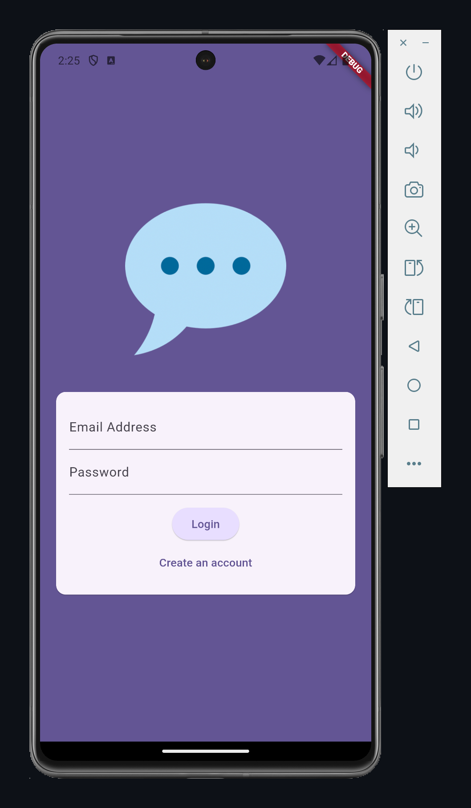
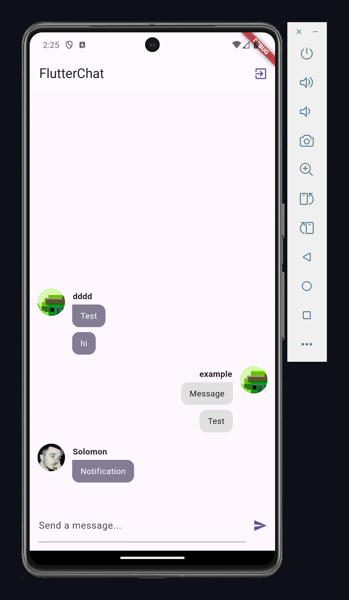

# Chat Flutter App

Chat Flutter App — чат-приложение, использующее Firebase для аутентификации и обмена сообщениями. В приложении есть экраны авторизации и основной чат. Оно поддерживает отправку сообщений, загрузку изображений и хранение данных в Firebase Firestore. 

## Технологии

- **Firebase (Auth, Firestore):** Аутентификация, хранение сообщений и изображений пользователей.
- **Provider:** Управление состоянием приложения.
- **Image Picker:** Загрузка аватаров и отправка изображений в чат.

